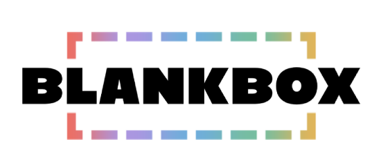

<p align="center">
  <picture>
    <source media="(prefers-color-scheme: dark)" srcset="public/brand/blankbox-logo-light.png">
    <source media="(prefers-color-scheme: light)" srcset="public/brand/blankbox-logo-dark.png">
    
  </picture>
</p>

<p align="center"><strong>Own it. Preserve it. Bring it home.</strong></p>

<p align="center">
  <a href="#download">Download</a> ·
  <a href="#install-from-a-zip">ZIP installation</a> ·
  <a href="#quick-start-with-docker">Docker quick start</a> ·
  <a href="#update-an-existing-installation">Update</a> ·
  <a href="https://github.com/blankboxcode/blankbox-community/wiki">Wiki</a> ·
  <a href="https://github.com/blankboxcode/blankbox-community/issues/new/choose">Feedback &amp; help</a>
</p>

# Your collection, in one private library

We built Blank Box Community to bring physical collections, files on your own drives and optional Plex/Jellyfin catalogs together. Keep track of what you own, where it lives and how you can enjoy it, with a catalog that runs on your computer and works offline.

- **Organize physical media:** record copies, editions, packaging, release labels and locations; save front/back artwork and build collections.
- **Connect your files:** index mounted drives and link files in place without copying or renaming originals.
- **Look up titles offline:** four included optional signed metapacks help with reference facts and organization. They contain no media or cover art.
- **Enjoy compatible media:** play browser-compatible files, read supported EPUB/CBZ documents, or open connected Plex/Jellyfin sources in their own service.
- **See every way to enjoy a title:** browse editions and artwork, choose playable sources, search your own streaming services, and record digital purchases or redeemed codes.
- **Keep your library yours:** save corrections, export your catalog and create checked recovery points for records and managed copies.

No Blank Box online account, subscription or connected media server is required. Browser codec and format limits apply; transcoding and protected video-disc copying are not included.

## Download

Choose the installation package for your computer. Each ZIP includes the application, setup tools and guides.

| Your installation | Download | Instructions |
| --- | --- | --- |
| Linux with systemd | [Linux / Docker ZIP](https://github.com/blankboxcode/blankbox-community/releases/download/v0.1.0-beta.10/blankbox-community-0.1.0-beta.10.zip) | [Linux ZIP install](#linux) |
| Docker on Linux | The same [Linux / Docker ZIP](https://github.com/blankboxcode/blankbox-community/releases/download/v0.1.0-beta.10/blankbox-community-0.1.0-beta.10.zip) | [Docker quick start](#quick-start-with-docker) |
| Windows 10/11 x64 — **experimental** | [Windows x64 ZIP](https://github.com/blankboxcode/blankbox-community/releases/download/v0.1.0-beta.8/blankbox-community-0.1.0-beta.8-windows-x64.zip) | [Windows ZIP install](#windows-experimental) |

**Installation ZIPs include the prebuilt interface: you do not need Node.js, npm or a source build.** Windows includes its own Python runtime; native Linux needs Python 3.10+.

[Linux / Docker release files and checksums](https://github.com/blankboxcode/blankbox-community/releases/tag/v0.1.0-beta.10) · [Verify your download](https://github.com/blankboxcode/blankbox-community/blob/v0.1.0-beta.10/UPDATES.md#trust) · [Platform status](https://github.com/blankboxcode/blankbox-community/blob/v0.1.0-beta.10/PLATFORMS.md)

Verify the package before running setup. A checksum detects changed bytes; first-download publisher trust needs independent confirmation of the signing-key fingerprint. The verification guide explains the trusted verifier.

The Windows download remains beta.8/schema 20 and does not include this Linux/Docker feature update.

These quick starts create a **fresh library**. For an existing library, follow [the update steps below](#update-an-existing-installation), [Updates](https://github.com/blankboxcode/blankbox-community/blob/v0.1.0-beta.10/UPDATES.md) or [Recovery](https://github.com/blankboxcode/blankbox-community/blob/v0.1.0-beta.10/RECOVERY.md). GitHub's automatic source archives and the source ZIP are developer downloads, not the guided installation package.

## Install from a ZIP

### Linux

Requires a Debian/Ubuntu-class computer with **Python 3.10+ and systemd**.

1. Download and extract the **Linux / Docker ZIP** above.
2. Open the extracted application folder until you see `setup-linux.sh` and `RELEASE.json`. Choose **Open in Terminal** in your file manager.
3. Run:

   ```sh
   sudo ./setup-linux.sh
   ```

4. Choose **Install or update**, select an access mode and use port `25265` for a fresh installation unless you need another port. Blank Box then runs as a background service.

| Linux access choice | Open Blank Box here |
| --- | --- |
| **1 — This computer** | On the server computer: `http://127.0.0.1:25265`. |
| **2 — Trusted home network by IP** | On the server or another trusted home-network device: `http://SERVER-IP:25265`. |
| **3 — The same network plus blankbox.local** | The same access as option 2, plus `http://blankbox.local:25265` where discovery works. The IP address still works. |

Replace `SERVER-IP` with the server's local address from its network settings or your router's device list. Use your chosen port in every address. Option 3 needs optional Avahi discovery packages **before** running setup; see the [Linux guide](https://github.com/blankboxcode/blankbox-community/blob/v0.1.0-beta.10/guides/LINUX.md).

Read the recovery key privately on the server:

```sh
sudo cat /var/lib/blankbox/access-key.txt
```

Open your chosen address, use the key to create your local owner username/password and complete setup. Keep the key for password recovery; normal sign-in uses your username and password.

None of the three access choices automatically enables outside-home Internet access or disables outgoing Internet. A private proxy or VPN configured separately has its own settings. [Networking help](https://github.com/blankboxcode/blankbox-community/wiki/Access-on-Your-Home-Network)

### Windows (experimental)

1. Download the **Windows x64 ZIP** and choose **Extract All** in File Explorer.
2. Open the extracted folder and double-click `setup-windows.cmd`. Choose **Install or update** and follow the prompts.
3. After setup, open PowerShell and start Blank Box:

   ```powershell
   powershell.exe -ExecutionPolicy Bypass -File "$env:LOCALAPPDATA\BlankBox\start-windows.ps1"
   ```

4. Keep that window open. Open `http://127.0.0.1:25265`, using your chosen port if different. Read `%LOCALAPPDATA%\BlankBox\data\access-key.txt` privately to claim your owner profile.

The optional startup task runs **after user sign-in**, not as an always-on Windows service. [Full Windows guide](https://github.com/blankboxcode/blankbox-community/blob/v0.1.0-beta.8/guides/WINDOWS.md)

## Quick start with Docker

Requires a **Linux host with Docker Engine and the Docker Compose plugin**. Host Python 3.10+ is used by the package verification tools. We build the image locally from the installation ZIP; there is no published Blank Box registry image. The first build may download the pinned Python base image.

1. Download, verify and extract the **Linux / Docker ZIP** above.
2. Open a terminal in the extracted application folder. Check that `compose.yaml`, `Dockerfile` and `blankbox.env.example` are visible.
3. Start a fresh empty library:

   ```sh
   cp -n blankbox.env.example .env
   docker compose up --detach --build --wait --wait-timeout 240
   ```

4. Read the first-owner recovery key privately:

   ```sh
   docker compose exec -T blankbox python3 -c 'print(open("/data/access-key.txt").read().strip())'
   ```

5. Open **[http://127.0.0.1:25265](http://127.0.0.1:25265)** on the Docker host, claim your owner profile and complete setup.

To connect another device on your **trusted home network**, change these values in your local `.env`:

```dotenv
BLANKBOX_BIND_ADDRESS=0.0.0.0
BLANKBOX_PUBLISHED_PORT=25265
```

Run `docker compose up --detach --wait --wait-timeout 240` to apply the change, then open `http://SERVER-IP:25265` on the other device. Use the host's local IP and your selected port. This does not set up outside-home access, a friendly name or HTTPS.

Your library persists in the `blankbox_blankbox-data` named volume. `docker compose down` retains it; omit `--volumes` when keeping the library. Follow the [Docker guide](https://github.com/blankboxcode/blankbox-community/blob/v0.1.0-beta.10/guides/DOCKER.md) to add read-only source mounts, a writable backup mount, or your own UID/GID and data bind folder. Our new-install default UID/GID is `1000:1000`; updates retain the existing installation's IDs. This empty-library quick start does not mount your drives or configure backups automatically.

## Make it your library

Start with a shelf, a folder or a connected catalog, then bring the rest of your collection together at your own pace.

| What you want to do | How it works |
| --- | --- |
| Catalog discs, books, records and other physical media | Add a title or scan a barcode, review the edition, then record each copy's format, condition and location. |
| Browse files on your drives | Configure a readable source folder, index it and review the proposed matches. Files remain in their original locations. |
| Bring in Plex or Jellyfin | Connect your existing server and sync its catalog. Keep its source alongside physical copies and local files for the same title. |
| Organize shelves and collections | Save custom groups or collections based on genre, format and other rules; record favorites and local activity. |
| Read, listen or watch | Choose an available source from a title. Use the built-in player or reader for supported files, a connected service, or a compatible external app. |
| Add and correct details | Open an item popup, choose details or artwork beside the cover, and edit a selected physical copy directly. Save title/edition artwork, packaging and release labels. |
| Save entry preferences | Choose starting formats by media type and a default title-search source in Settings → Collection → Physical Media preferences. |
| Record digital ownership | Add purchased, redeemed or code-included platform records separately from playback and streaming searches. |

A title, an edition and a copy describe different parts of your collection. A digital file or connected source gives access to a title; it does not automatically record an owned physical copy. Review possible matches before combining records.

[Getting started](https://github.com/blankboxcode/blankbox-community/wiki/Getting-Started) · [Using your library](https://github.com/blankboxcode/blankbox-community/wiki/Using-Your-Library) · [Organizing collections](https://github.com/blankboxcode/blankbox-community/wiki/Organizing-Collections) · [Offline metapacks](https://github.com/blankboxcode/blankbox-community/wiki/Offline-Metapacks)

Learn how to manage [packaging, artwork and digital copies](guides/COLLECTOR-DETAILS.md), or set up [sign-in, optional OIDC and password recovery](guides/ACCOUNTS.md). Blank Box currently uses one shared household account.

## Update an existing installation

Download and extract the new **Linux / Docker installation ZIP** into a separate folder. Create a complete recovery point first and verify the package with your installed trusted verifier. Keep the same library location and your existing settings.

**Native Linux:** open a terminal in the new extracted folder and run:

```sh
python3 /opt/blankbox/current/release_files.py . --trusted-key /opt/blankbox/current/release-trust.json
sudo ./install-linux.sh
```

This keeps your account, library, port, access mode, sources and backup configuration.

**Docker:** copy your existing `.env` and any local Compose overrides into the new folder. Keep the same project name, image setting, UID/GID and volume or bind folder, then run:

```sh
./upgrade-docker.sh
```

The helper keeps existing numeric IDs, including `10001:10001`; it does not move data or change ownership. Relative bind paths must still resolve to the same existing folders.

Open your usual address, sign in and refresh the browser. Check your items, artwork and sources. This update migrates beta.8/beta.9 catalogs from **schema 20 to 22**. Keep the previous application and paired snapshot; returning to older code requires that earlier catalog state. [Full update and rollback guide](UPDATES.md)

## Protect your library

Use a separate backup drive and test a restore into a **new empty destination**. Library recovery protects saved records, managed copies and paired offline-pack assets. It **cannot recreate missing linked source-drive originals**; protect those bytes separately. Portable restore excludes account/provider secrets, so reconnect Plex/Jellyfin afterward.

Core and metapacks update independently and optionally. Keep earlier software and paired recovery material for rollback. [Recovery](https://github.com/blankboxcode/blankbox-community/blob/v0.1.0-beta.10/RECOVERY.md) · [Updates](https://github.com/blankboxcode/blankbox-community/blob/v0.1.0-beta.10/UPDATES.md)

## Feedback and support

We welcome [bugs, setup questions, feedback and experiences](https://github.com/blankboxcode/blankbox-community/issues/new/choose). Include your installed version, device/OS, action, expected result and actual result. Keep household titles, paths, credentials, catalogs and backups out of public reports. Support is best effort.

[Feedback guide](FEEDBACK.md) · [Support](SUPPORT.md) · [User guides](https://github.com/blankboxcode/blankbox-community/wiki)

## License and source builds

Our original code is **source available for personal, noncommercial use** under [LICENSE](LICENSE). Redistribution and commercial use require separate permission. Third-party components retain their own licenses; see [THIRD-PARTY-NOTICES.md](THIRD-PARTY-NOTICES.md).

<details>
<summary>Build the browser client from source (developers)</summary>

Use Node.js 22.13+, Python 3.10+ and SQLite FTS5:

```sh
npm ci
npm run typecheck
npm run build
python3 box/server.py --data /path/to/new-blankbox-data --port 25265
```

The Core has no required third-party Python packages. To include the distributed starter packs in a source build, copy the signed `bundled-metadata` directory from the matching installation package into `box/` before first start.

</details>

